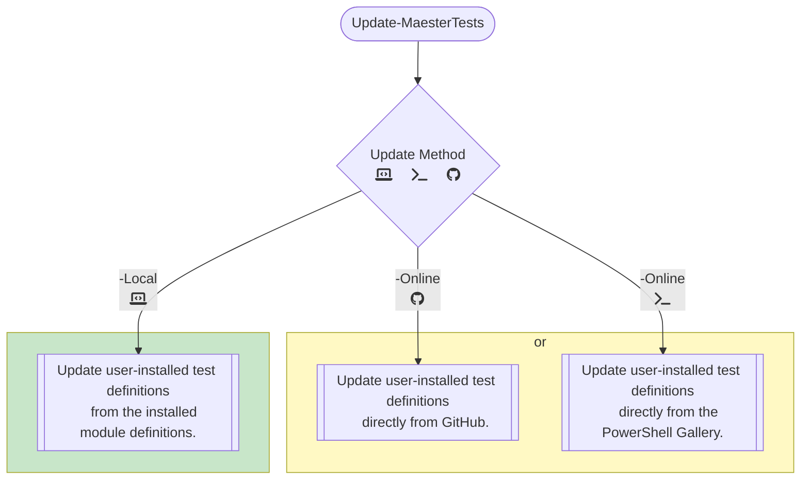

# Update Process for Tests

Here are several concepts for updating Maester tests more precisely. For an update source, they use either GitHub, the PowerShell Gallery, or the module's local install folder as the source for updates.

Updating from the module's installation location will require the module itself to be updated in order to update the Maester tests. Installing from GitHub or the PowerShell Gallery will allow faster updates of Maester tests without needing to update the entire module.



## Versioning the Tests

We will need to track the version of tests in order to know when to update them. We will also track the lifecycle status of tests in order to know when to disable or remove them.

### Option 1: Track tests in a single file

Test versions and status could be tracked in a single file in the module. This approach could use a list of custom objects in PowerShell:

```powershell
[System.Collections.Generic.List[PSCustomObject]]$TestVersions = @()
$TestVersions.Add( [PSCustomObject]@{
  Name = "TestName 1"
  Version = [version]'0.1.1'
  Status = "Active"
} )
$TestVersions.Add( [PSCustomObject]@{
  Name = "TestName 2"
  Version = [version]'0.0.1'
  Status = "Testing"
} )
$TestVersions.Add( [PSCustomObject]@{
  Name = "TestName 3"
  Version = [version]'0.0.2'
  Status = "Deprecated"
} )
$TestVersions.Add( [PSCustomObject]@{
  Name = "TestName 4"
  Version = [version]'0.2.4'
  Status = "Removed"
} )
```

Or potentially as JSON, if that is preferred by some:

```json
{
  "tests": [
    {
      "Name": "Test Name 1",
      "Version": "0.1.1",
      "Status": "Active"
    },
    {
      "Name": "Test Name 2",
      "Version": "0.0.1",
      "Status": "Testing"
    },
    {
      "Name": "Test Name 3",
      "Version": "0.0.2",
      "Status": "Deprecated"
    },
    {
      "Name": "Test Name 4",
      "Version": "0.2.4",
      "Status": "Removed"
    }
  ]
}
```
