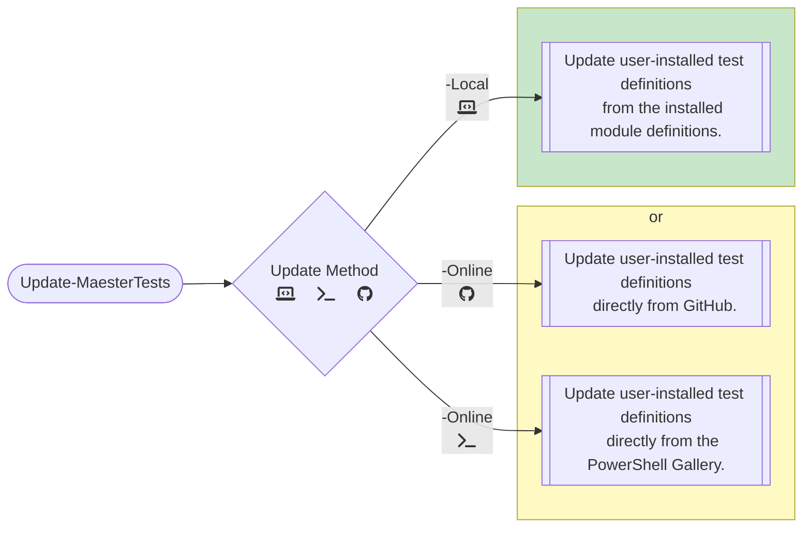

# Update Process for Tests

Can we find a good way to efficiently update specific tests using a process separate from updating the whole module? Can we find a way to gracefully deprecate and remove tests if needed in the future?

**TLDR:** What if we use PSScriptInfo in each of the Maester test files to track their version and status? Would Maester also benefit from splitting tests into their own repository?

Here are several concepts for updating Maester tests more frequently and precisely. For an update source, they might use either GitHub, the PowerShell Gallery, or the module's local install folder as the source for updates.

- Updating from the module's local installation location will require the module itself to be updated in order to update the Maester tests.
- Updating from GitHub or the PowerShell Gallery will allow faster updates of Maester tests without needing to update the entire module.



## Versioning the Maester Tests Files

Tracking the version of each test will allow us to know when to update each one. (This approach could potentially be applied to an entire bundle of tests, such as the CISA or EIDSCA tests.) We can also track the lifecycle status of each test to know when to disable or remove them.

### Option 1: Track tests in a central location

Test versions and status could be tracked in a single location in the module. This approach could use a list of custom objects in a PowerShell function or store the details as JSON.

#### Advantages (Option 1)

- One place to track everything
- The data can be stored with the installed module and referenced by update functions

#### Disadvantages (Option 1)

- Could result in test updates still being tied to module updates
- May become error prone and unsustainable to update a central file with every test version change

#### Examples (Option 1)

```powershell
# Create a list of custom objects describing the version and status of each test
[System.Collections.Generic.List[PSCustomObject]]$TestVersions = @()
$TestVersions.Add( [PSCustomObject]@{
  Name = "TestName 1"
  Version = [version]'0.1.1'
  Status = "Active"
} )
$TestVersions.Add( [PSCustomObject]@{
  Name = "TestName 2"
  Version = [version]'0.0.1'
  Status = "Testing"
} )
$TestVersions.Add( [PSCustomObject]@{
  Name = "TestName 3"
  Version = [version]'0.0.2'
  Status = "Deprecated"
} )
$TestVersions.Add( [PSCustomObject]@{
  Name = "TestName 4"
  Version = [version]'0.2.4'
  Status = "Removed"
} )
```

Or potentially as JSON, if that gives the project any added flexibility:

```json
{
  "tests": [
    {
      "Name": "Test Name 1",
      "Version": "0.1.1",
      "Status": "Active"
    },
    {
      "Name": "Test Name 2",
      "Version": "0.0.1",
      "Status": "Testing"
    },
    {
      "Name": "Test Name 3",
      "Version": "0.0.2",
      "Status": "Deprecated"
    },
    {
      "Name": "Test Name 4",
      "Version": "0.2.4",
      "Status": "Removed"
    }
  ]
}
```

### Option 2: Add version and status metadata in every individual test file

The concept below uses PSScriptInfo data to store version, status, and other details directly in each test's PS1 file. This can be templatized and then updated either by a developer or by GitHub actions after changes are made. During the update process, the PSScriptInfo for each test can be compared to the details of the latest tests available online.

In short, if the .VERSION data for a given test's PSScriptInfo in your `maester-tests` folder is older than the test's PSScriptInfo.VERSION in the repository, then the `Update-MaesterTests` function could update that specific function. If the test file in the repository has 'Deprecated' or 'Removed' in its PSScriptInfo.TAGS, then the update function can perform relevant actions on the management endpoint where the module is being used.

> [!NOTE]
> As an aside, each test *could* then be published independently to the PowerShell Gallery as a function, but I do not believe people would like to see dozens or hundreds of individual scripts installed in this manner.

#### Advantages (Option 2)

- Every test can be versioned and updated or retired independently
- An update process for the tests can be separated from updates for the module
- Updates of tests could become very fast if only updating changed/removed tests
- A history of test versions and lifecycle might become easier for users to track
- Additional metadata for each test could become easier to track

#### Disadvantages (Option 2)

- Adds an extra step to the creation of every test
- Test files become slightly larger

#### Examples (Option 2)

Add the test's status, version, and even tags using PSScriptInfo tags.
The related markdown documentation file can also be paired via .PrivateData.

```powershell
<#PSScriptInfo
.DESCRIPTION Maester Test: Test-MtCisaActivationNotification.ps1
.VERSION 0.0.1
.AUTHOR Maester Team
.TAGS Active, CISA, Entra
.PRIVATEDATA @{ Markdown='Test-MtCisaActivationNotification.md'; Reference='https://domain.com/moreinfo' }
#>

<#
.SYNOPSIS
    Checks for notification on role activation
.DESCRIPTION
    User activation of the Global Administrator role SHALL trigger an alert.
    User activation of other highly privileged roles SHOULD trigger an alert.
#>

function Test-MtCisaActivationNotification {
  # [... shortened for brevity ...] #
}

```

For a complete example, see the test scripts in my ['Maester-Test-Versioning' branch](https://github.com/SamErde/maester/tree/Maester-Test-Versioning). The [build\Add-PSScriptInfo.ps1](https://github.com/SamErde/maester/blob/Maester-Test-Versioning/build/Add-PSScriptInfo.ps1) script was used to get started and add PSScriptInfo to existing tests.

> [!NOTE]
> The *-PSScriptFileInfo cmdlets require script file info to include Version, GUID, Description, and Author properties. These are required for a valid file to be published to the PowerShell Gallery. We could automate the creation of GUIDs, or we can easily avoid that potentially unnecessary step by adding a function that directly queries PSScriptInfo without using the **Microsoft.PowerShell.PSResourceGet** module. (Fewer dependencies on the endpoint are always good as well.) The official module source uses a compiled function, but I also found an example script function written by [Hannes Palmquist](https://github.com/hanpq) at <https://github.com/hanpq/PSScriptInfo/blob/main/source/Private/Get-PSScriptInfoLegacy.ps1>.

**POC functions to read and collate version info is still in progress...**

> [!NOTE]
> The next step would be to write a function that compares this PSScriptInfo in the user's [maester-tests] folder to the PSScriptInfo in either:
>
> - the module's local installation (PSScriptRoot) path
> - the matching script in the GitHub repository
> - possibly something published to the PowerShell Gallery (?)

### Option 3: Combine options 1 and 2

The third, and possibly best option may be to use PSScriptInfo to track version and status in each individual file while also automating the creation of a single centralized list.

In the repository, a GitHub action could easily pull information about every script and write that to a file. Locally, a function could easily pull name/version/status information from each script in [maester-tests] into a list and then compare that list to the latest list from the repository.

#### Advantages (Option 3)

- Avoid having to send web requests for every version check of every individual file
- Maintain lifecycle information in individual test files and one central file automatically

#### Disadvantages (Option 3)

- Are we going to end up writing to AppData? 🫠
- ...?

## Additional Conclusions

Working through this thought exercise has stimulated another thought: it may also be helpful to create a new, separate repository for 'maester-tests' in the 'maester' organization.

This may make it easier to version tests, build and version bundles of tests for specific test sources, and check/update tests from clients.

## Follow-Up

### Potential Process

Add a property for source repository URI if a 3rd party test set.

Add for each list.

Create list to remove or deprecate
Create list to update
Create list to add
Check status tag of reference object
Look for GUID that exists only on one side.
Compare version property for matched GUIDs.
Add script to compare local object to reference object (repo).

Update template for all tests.
Add meta data for all tests.
Add local check with rollup to one custom object for comparison.
Add Pester validation of tests to ensure they have required tags and metadata.
Add GitHub action check that creates one JSON object in GH and also pushes it to the Maester.dev site.
